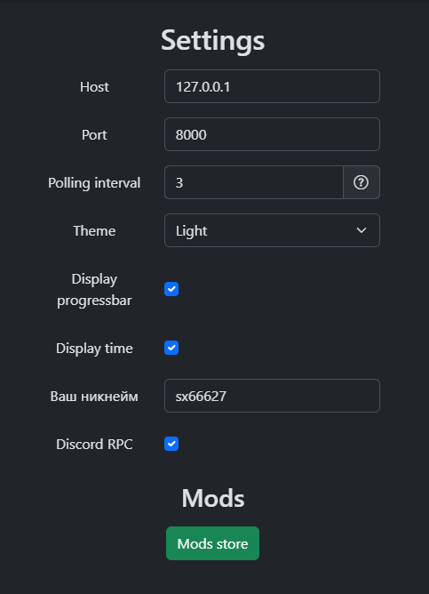
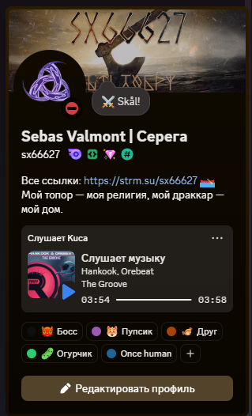

# Melody Monitor Extended

## Введение
Это форк программы [Melody Monitor for OBS](https://github.com/SuperZombi/melody-monitor). Я взял её и дописал функционал, который  мне был необходим. После, упаковал в единственный exe файл как и у автора.

## Возможности

* Остлеживание воспроизведения музыки в windows (плееры, браузеры и т.д.). И вывод информации в браузере (для OBS).
* Поддержка модов.
* Отправка информации по треку и обложки (если есть) моему боту KucaBot. ✧
* Вывод статуса в Discord о прослушивании. ✧

*✧ - написано мной.*

## Как пользоваться
Скачайте последнюю версию: [Скачать](https://github.com/sx66627/melody-monitor-kuca/releases/latest/download/Melody-monitor.exe)

Запускаете приложение. После запуска оно будет находится в трее (возле часов).

Нажмите "Settings" и настройте приложение как вам удобно.

Укажите никнейм, если хотите отправлять данные о прослушивании боту. Потом можно через бота узнать, какой трек сейчас прослушивается.

> Важно!
> Что бы работал статус в дискорд. Нужно отправлять данные боту, для отображения обложки.

Если вам не нужна отправка боту, оставьте ник по умолчанию. Или сделайте пустым.

Если нужно выводить статус в дискорд, установите галочку у "Discord RPC".

Сохраните настройки, нажав кнопку "Save". И перезапустите приложение.

Что бы вывести трек в OBS. Нажмите "Open in Browser". Скопируйте адрес страницы и добавьте в OBS как источник браузера.

## Обратная связь
По всем вопросам, предложениям - создавайте issue.